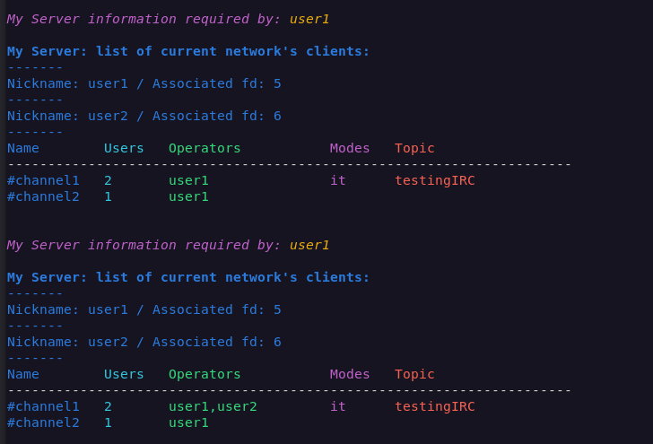
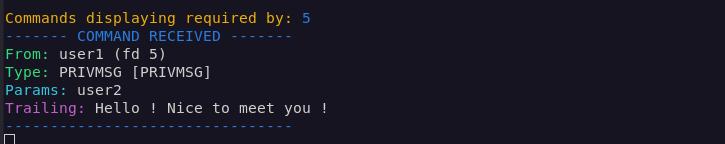
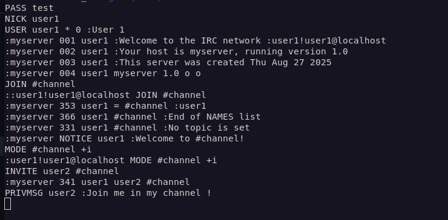

# ft_irc - IRC Server

# Table of Contents

1. [Description](#📌-description)
2. [Features](#⚙️-features)
   - [Core Features](#core-features)
   - [Custom Commands](#custom-commands-available-with-netcat-for-testing)
   - [Extra Goodies](#extra-goodies)
3. [Installation](#🛠️-installation)
   - [Requirements](#requirements)
   - [Steps](#steps)
4. [Compilation](#🛠️-compilation)
5. [Usage](#🚀-usage)
6. [Connecting Clients](#💻-connecting-clients)
7. [Netcat Session Example](#✉️-netcat-session-example)


## 📌 Description
`ft_irc` is a custom implementation of an **IRC server** written in **C++98**, following the IRC protocol specification (**RFC 1459**).  

It handles multiple clients simultaneously using **non-blocking sockets** and **epoll**, supports the essential IRC commands, and can interact seamlessly with standard IRC clients such as **irssi** or testing tools like **netcat**.  

The goal of this project is to explore **network programming**, **protocol parsing**, and **event-driven server design**.

---


## ⚙️ Features

### Core Features

- Multiple client connections using `epoll` (no multi-threading).
- Client authentication with `PASS`, `NICK`, and `USER`.
- User management:
  - Change nickname (`NICK`)
  - Quit (`QUIT`)
- Channel management:
  - Join and leave channels (`JOIN`)
  - Channel topics (`TOPIC`)
  - Channel modes (`MODE`)
  - Kicking and inviting users (`KICK`, `INVITE`)
  - Automatic channel deletion when empty
- Private messaging (`PRIVMSG`).
- Proper numeric error replies (RFC-compliant).

### Custom Commands (available with netcat for testing)

- **`MYSERVER`**  
  Displays current server state (only available with netcat) :
 
  - Connected clients (nicknames + file descriptors)  
  - Active channels with:
    - User count
    - Operator nicknames
    - Topic
    - Modes
   


- **`DISPLAYCMDS`**  
  Enables/disables **per-client command debugging** on the server terminal.  
  When active, the server logs every command received from this client with:
  
  - Command type  
  - Parameters  
  - Trailing part

 

### Extra Goodies

- Built-in debug outputs for server activity.

---


## 🛠️ Installation

### Requirements

- **Linux environment** (tested on Ubuntu/Debian)  
- **C++98 compiler** (e.g. `c++`)  
- **Make** build system

### Steps

1. Clone the repository:
   ```bash
   git@github.com:TChobert/42Cursus-ft_irc.git
   cd ft_irc

2. Compile the project:
   ```bash
   make

3. Run the server:
   ```bash
   ./ircserv <port> <password>

4.Connect using an IRC client (e.g. irssi or nc).


---


## 🛠️ Compilation

The project is written in **C++98**. To compile:

```bash
make
```
---


## 🚀 Usage

Start the server with:

./ircserv <port> <password>

- <port> → the listening port (e.g. 6667)

- <password> → the password required for client connections

Example :

```bash
./ircserv 6667 mypass
```

---


## 💻 Connecting Clients

Recommended clients:

- netcat (for testing)
- irssi

Using netcat (for testing):

```bash
nc -C <host> <port>
```

```bash
nc -C localhost 6667
```

Using irssi:

```bash
irssi -c <host> -p <port> -w <server_password> -n <nickname>
```

```bash
irssi -c localhost -p 6667 -w mypass -n mynick

```

---

## ✉️ Netcat session example:

- Single client view:




- Multiple clients:

```bash

# Terminal 1: Start the IRC server
./ircserv 6667 superpass

# Terminal 2: Connect client 1 (Eve)
nc -C localhost 6667
PASS superpass
NICK eve
USER eve 0 * :Eve Example
JOIN #fun
MYSERVER
PRIVMSG #fun :Hi everyone, Eve joined the fun!

# Terminal 3: Connect client 2 (Mallory)
nc -C localhost 6667
PASS superpass
NICK mallory
USER mallory 0 * :Mallory Test
JOIN #fun
PRIVMSG #fun :Hello Eve! Welcome to #fun
DISPLAYCMDS

# Terminal 4: Connect client 3 (Trudy)
nc -C localhost 6667
PASS superpass
NICK trudy
USER trudy 0 * :Trudy User
JOIN #fun
PRIVMSG #fun :Hey folks, Trudy is here!
MYSERVER
QUIT :See you later!
```

